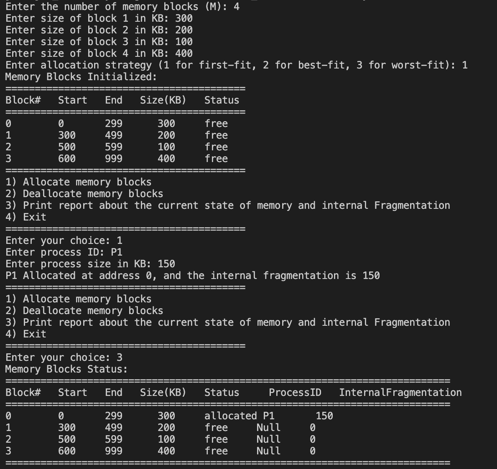
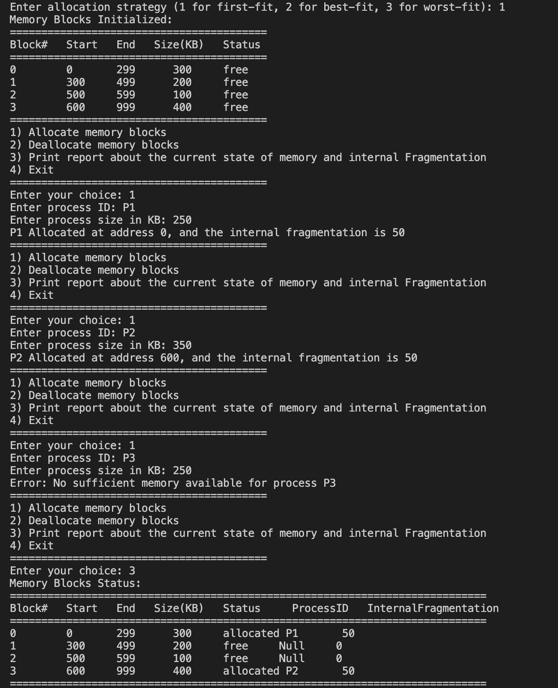
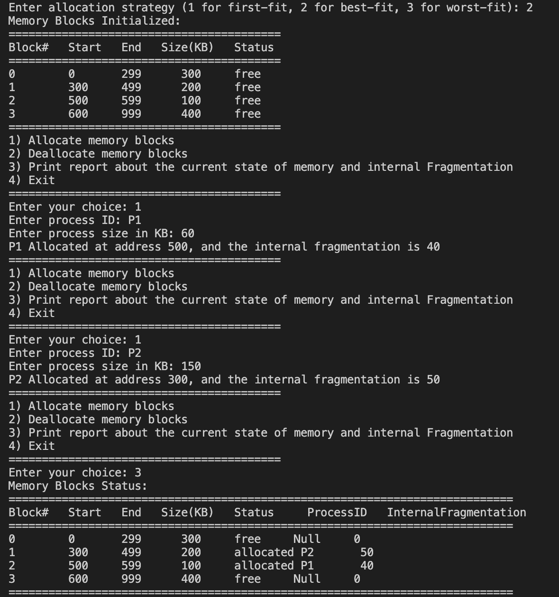
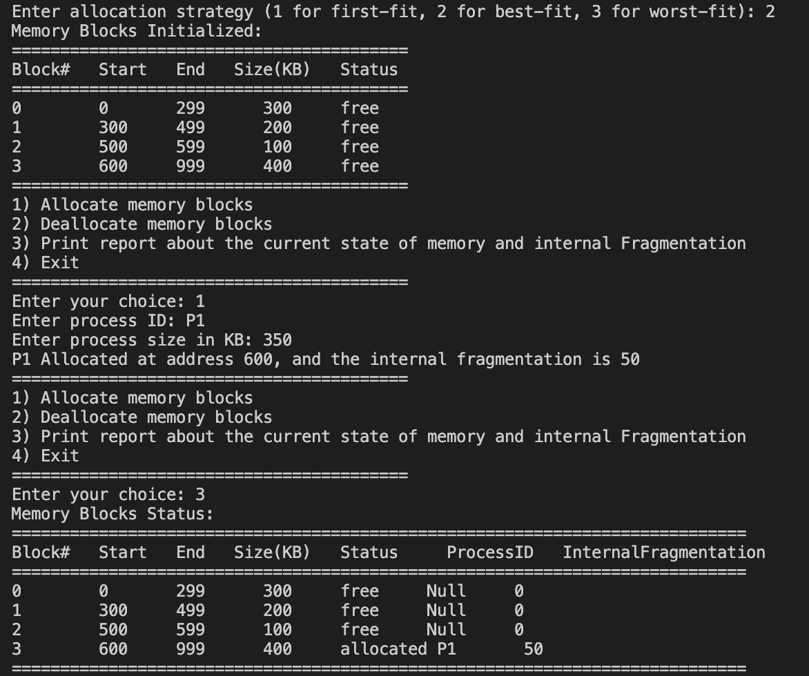
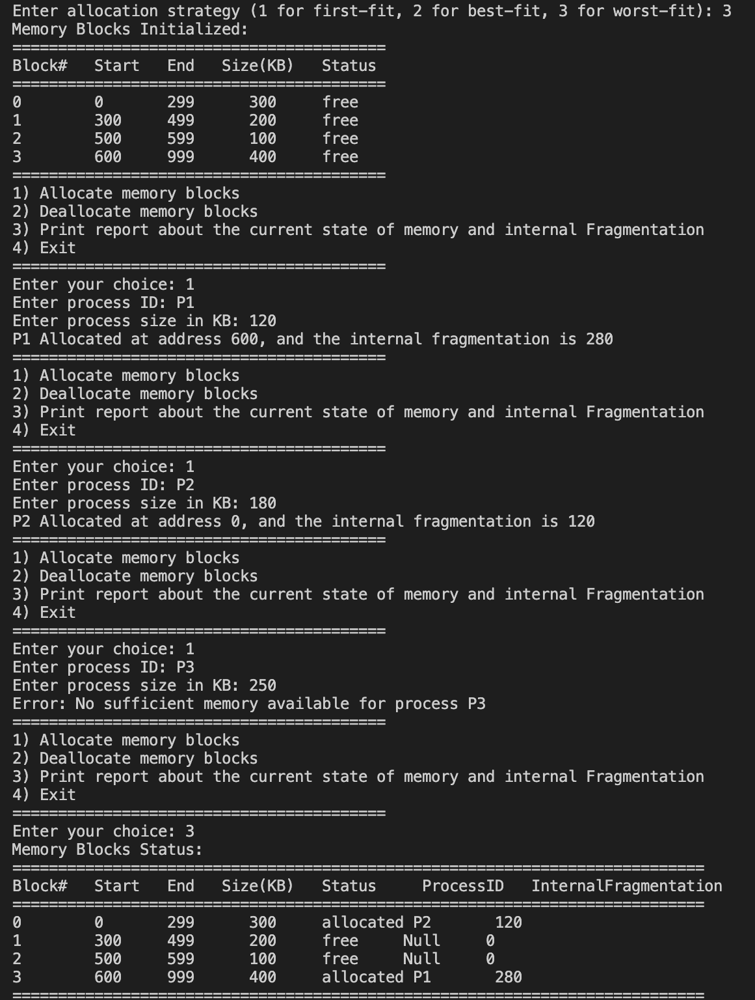
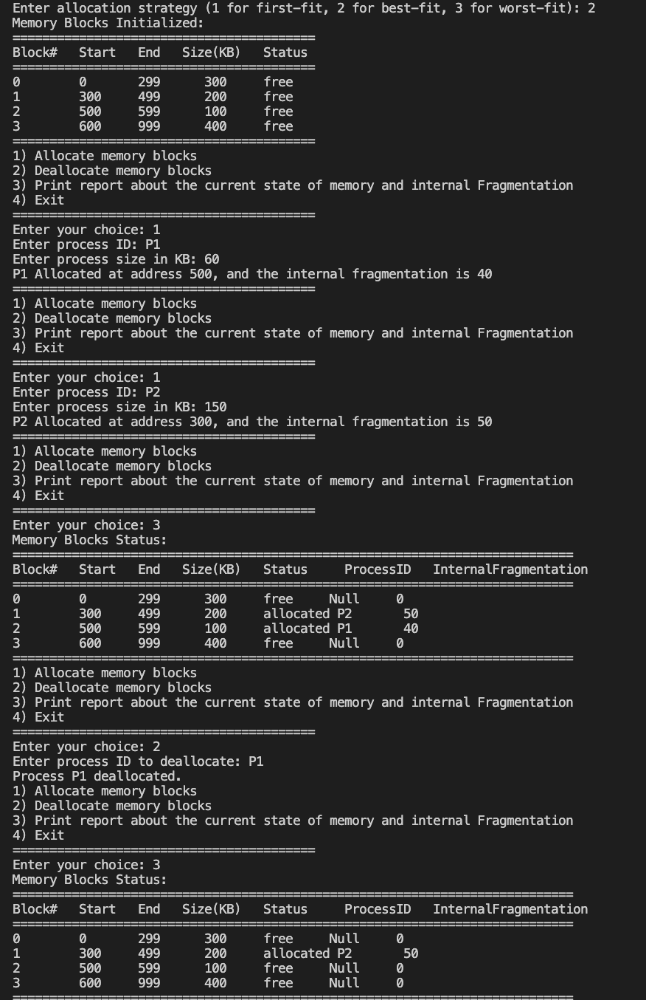

## Project Overview

This project simulates **memory fragmentation** using three memory allocation strategies:

- **First-Fit** → Allocates the first available block large enough to fit the process.
- **Best-Fit** → Allocates the smallest available block that fits the process.
- **Worst-Fit** → Allocates the largest available block.

###  Features:
✔ Allocate memory for processes  
✔ Deallocate memory  
✔ View **detailed memory status reports** including fragmentation  

---

## Screenshots & Sample Outputs

### **First-Fit Allocation**
1. **First-fit allocates P1 (150 KB) to the first suitable block (Block0, 300 KB), leaving 150 KB of internal fragmentation.**  
   

2. **First-fit allocates P1 (250 KB) to Block0 and P2 (350 KB) to Block3, but fails to allocate P3 (250 KB) as the remaining blocks (200 KB, 100 KB) are too small.**
   

### **Best-Fit Allocation**
3. **Best-fit allocates P1 (60 KB) to Block2 (100 KB) and P2 (150 KB) to Block1 (200 KB), choosing the smallest suitable blocks to reduce fragmentation.**  
   

4. **Best-fit allocates P1 (350 KB) to Block3 (400 KB), the smallest block that fits, as no smaller blocks (300 KB, 200 KB, 100 KB) are sufficient.**  
   

### **Worst-Fit Allocation**
5. **Worst-fit allocates P1 (150 KB) to Block3 (400 KB), the largest available block, resulting in 250 KB of internal fragmentation.**  
   

6. **Worst-fit allocates P1 (120 KB) to Block3 (400 KB) and P2 (180 KB) to Block0 (300 KB), leaving only smaller blocks (200 KB, 100 KB), which cannot accommodate P3 (250 KB).**
   

### **Memory Deallocation Example**
7. **Best-fit allocates P1 (60 KB) and P2 (150 KB), then deallocates P1, freeing Block2 (100 KB) for future use.**  
   

---

## Team Members 

- **Leen Alotaibi** (Leader) – `443200417`
- **Jood Alkhrashi** – `444203007`
- **Lujain Alhusan** – `444200785`  
- **Najla Almazyad** – `444200948`  

### **Task Distribution Table**  

| #  | Name              | Student ID | Role                                |
|----|------------------|-------------|-------------------------------------|
| 1  | **Leen**         | *443200417* | Memory Initialization               | 
| 2  | **Najla**        | *444200948* | First-Fit Algorithm                 |
| 3  | **Jood**         | *444203007* | Best-Fit Algorithm                  |
| 4  | **Lujain**       | *444200785* | Worst-Fit Algorithm                 |
| 5  | **Lujain**       | *444200785* | Fragmentation Measurement           |
| 6  | **Najla**        | *444200948* | Simulation & User Interaction       |
| 7  | **Leen**         | *443200417* | Report Documentation                |
